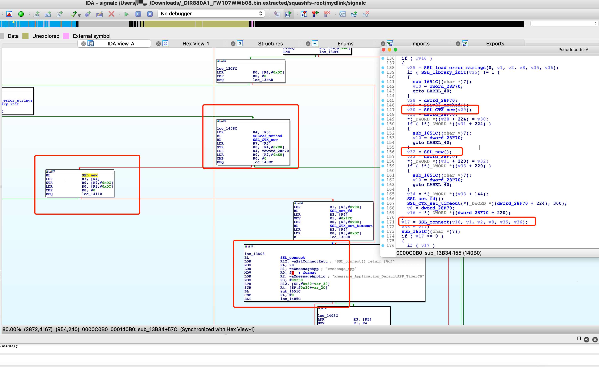

# Affected components

affected binary file: squashfs-root/mydlink/signalc

# Attack vector(s)

Missing SSL_CTX_set_verify() after SSL_new().
SL_CTX_set_verify() should be called after SSL_new().

# Suggested description of the vulnerability for use in the CVE

Man-In-The-Middle vulnerability in SSL handshake process in D-Link DIR-880L router V1.07 (and earlier) due to missing SSL_CTX_set_verify() after SSL_new().

As shown in the following figure, D-Link does not call SSL_CTX_set_verify() after SSL_new(), causing the vulnerability.


The following is a standard certificate chain validation with OpenSSL APIs.

```c
const SSL_METHOD *method; 
SSL_CTX *ctx; 
SSL *ssl; 
[...] 
//select protocol 
method = TLSv1_client_method(); 
[...] 
//Create CTX 
ctx = SSL_CTX_new(method); 
[...] 
//Create SSL 
ssl = SSL_new(ctx); 
[...] 
//set SSL_VERIFY_PEER flag to enforce certificate chain validation during handshake 
SSL_CTX_set_verify(ctx, SSL_VERIFY_PEER,...); 
[...] 
//Start handshake 
SSL_connect(ssl); 
[...]
```

# Discoverer(s)/Credits

UVScan

# Reference(s)
https://www.openssl.org/docs/manmaster/man3/SSL_new.html

https://www.openssl.org/docs/manmaster/man3/SSL_CTX_set_verify.html

https://d2okd4tdjucp2n.cloudfront.net/DIR-880L/DIR-880L_A1_FW_1.07.zip