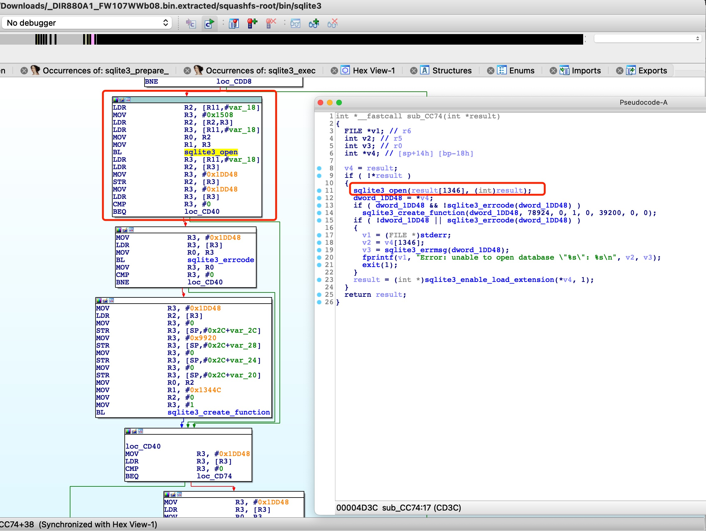

# Affected components

affected binary file: squashfs-root/bin/sqlite3

# Attack vector(s)

Missing sqlite3_close() after sqlite3_open().
Whether or not an error occurs when it is opened, resources associated with the database connection handle should be released by passing it to sqlite3_close() when it is no longer required.

# Suggested description of the vulnerability for use in the CVE

Information disclosure vulnerability in D-Link DIR-880L router V1.07 (and earlier) due to missing sqlite3_close() after sqlite3_open().

As shown in the following figure, D-Link does not call sqlite3_close() after sqlite3_open(), causing the vulnerability.

# Discoverer(s)/Credits

UVScan

# Reference(s)
https://www.sqlite.org/c3ref/open.html
https://d2okd4tdjucp2n.cloudfront.net/DIR-880L/DIR-880L_A1_FW_1.07.zip
