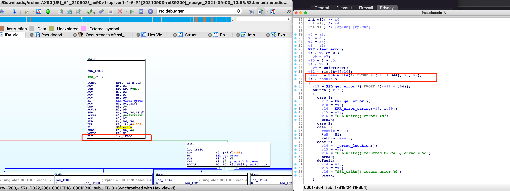

# Affected components

affected binary file: ubifs-root/416934258/rootfs_ubifs/usr/lib/libcurl.so.4

# Attack vector(s)

Incorrect SSL_write() return value check.
SSL_write() returns >0 on success or <=0 on error.

# Suggested description of the vulnerability for use in the CVE

Privacy leakage vulnerability in SSL_write() function in TP-Link Archer AX90 router V1.20 (and earlier) due to incorrect SSL_write() return value check.

As shown in the following figure, TP-Link checks the return value of SSL_write() as <0 rather than <=0, causing the vulnerability.

# Discoverer(s)/Credits

UVScan

# Reference(s)
https://www.openssl.org/docs/man1.0.2/man3/SSL_write.html

https://www.tp-link.com/us/support/download/archer-ax90/v1.20/#Firmware