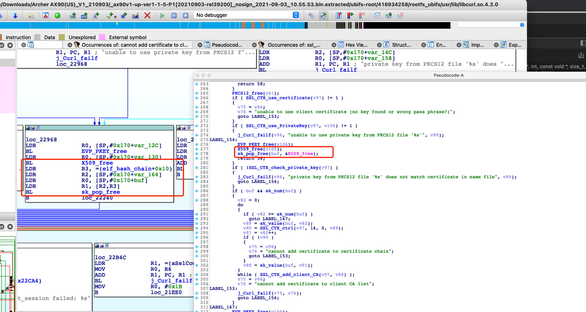

# Affected components

affected binary file: ubifs-root/416934258/rootfs_ubifs/usr/lib/libcurl.so.4.3.0

# Attack vector(s)

Freeing data related to the handling of the certificate which may have already been freed by SSL_CTX_free call.

# Suggested description of the vulnerability for use in the CVE

Double free vulnerability in TP-Link Archer AX90 router V1.20 (and earlier) due to double free data related to the handling of the certificate which may have already been freed by SSL_CTX_free call.

As shown in the following figure, TP-Link first calls the x509_free and then calls the sk_X509_pop_free,  causing the vulnerability.

# Discoverer(s)/Credits

UVScan

# Reference(s)
https://sourceforge.net/p/curl/bugs/1236/

https://www.tp-link.com/us/support/download/archer-ax90/v1.20/#Firmware