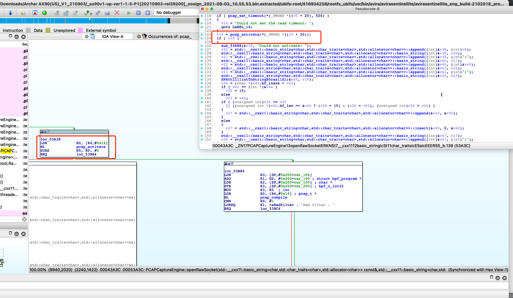

# Affected components

affected binary file: ubifs-root/416934258/rootfs_ubifs/usr/bin/avira/avirasentinellite/avirasentinellite

# Attack vector(s)

Incorrect pcap_activate() return value check.
pcap_activate() returns 0 on success without warnings, a non-zero positive value on success with warnings, and a negative value on error.

# Suggested description of the vulnerability for use in the CVE

Privacy leakage vulnerability in pcap_activate() function in TP-Link Archer AX90 router V1.20 (and earlier) due to incorrect pcap_activate() return value check.

As shown in the following figure, TP-Link checks the return value of pcap_activate() as != 0 rather than <0, causing the vulnerability.

# Discoverer(s)/Credits

UVScan

# Reference(s)
https://www.tcpdump.org/manpages/pcap_activate.3pcap.html

https://www.tp-link.com/us/support/download/archer-ax90/v1.20/#Firmware