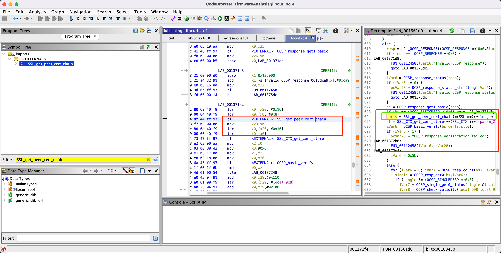

# Affected components

affected binary file: squashfs-root/usr/lib/libcurl.so.4

# Attack vector(s)

Missing SSL_get_peer_cert_chain() return value check.

SSL_get_peer_cert_chain() has the following return values:

NULL

No certificate was presented by the peer or no connection was established or the certificate chain is no longer available when a session is reused.

Pointer to a STACK_OF(X509)

The return value points to the certificate chain presented by the peer.

# Suggested description of the vulnerability for use in the CVE

Null pointer dereference vulnerability in verifystatus() function in Redmi AX6 1.1.10 (and earlier) due to missing SSL_get_peer_cert_chain() return value check.

As shown in the following figure, Redmi does not check the return value of SSL_get_peer_cert_chain, causing the vulnerability.

# Discoverer(s)/Credits

UVScan

# Reference(s)
https://www.openssl.org/docs/man1.1.1/man3/SSL_get_peer_cert_chain.html

https://mirom.ezbox.idv.tw/miwifi/RA69/roms-stable/

https://github.com/curl/curl/pull/8579