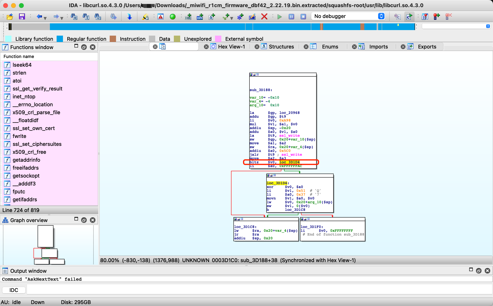

# Affected components

affected binary file: squashfs-root/usr/lib/libcurl.so.4.3.0

# Attack vector(s)

Incorrect SSL_write() return value check.
SSL_write() returns >0 on success or <=0 on error.

# Suggested description of the vulnerability for use in the CVE

Privacy leakage vulnerability in SSL_write() function in Xiaomi  router 2.22.19 (and earlier) due to incorrect SSL_write() return value check.

As shown in the following figure, Xiaomi checks the return value of SSL_write() as <0 rather than <=0, causing the vulnerability.

# Discoverer(s)/Credits

UVScan

# Reference(s)
https://www.openssl.org/docs/man1.0.2/man3/SSL_write.html

https://mirom.ezbox.idv.tw/en/miwifi/R1CM/roms-stable/